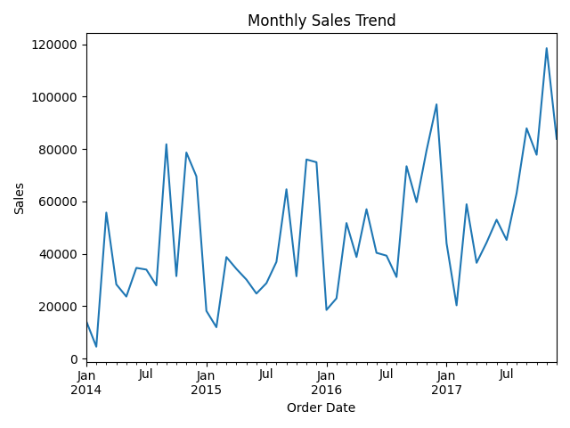

# 📊 Sales Forecasting & Business Intelligence

## 📌 Project Overview
This project focuses on analyzing historical sales data to uncover business insights and build a forecasting model to predict future sales trends. The objective is to support data-driven decision-making using Python, SQL, and Business Intelligence techniques.

The project covers the complete data analytics lifecycle — from raw data processing to forecasting and reporting.

---

## 🎯 Objectives

- Clean and preprocess raw sales data
- Perform Exploratory Data Analysis (EDA)
- Identify revenue trends and seasonal patterns
- Detect loss-making products and categories
- Build a sales forecasting model
- Generate actionable business insights
- Create structured SQL-based analysis queries

---

## 🛠️ Tools & Technologies Used

- **Python**
- Pandas
- NumPy
- Matplotlib
- SQLite
- SQL
- Power BI (for dashboard visualization)
- Excel

---

## 📂 Project Structure
Sales-Forecasting-Business-Intelligence/
│
├── data/
│ ├── raw/
│ │ └── sales.csv
│ └── processed/
│ ├── sales_cleaned.csv
│ ├── monthly_sales.csv
│ ├── sales_forecast.csv
│ ├── profit_by_category.csv
│ ├── loss_products.csv
│ └── monthly_sales_trend.png
│
├── scripts/
│ ├── 01_load_and_check_data.py
│ ├── 02_data_cleaning.py
│ ├── 03_eda.py
│ └── 04_forecasting.py
│
├── sql/
│ └── sales_analysis.sql
│
└── dashboards/
└── sales.db

---

## 🔍 Key Analysis Performed

### 📈 1. Exploratory Data Analysis (EDA)
- Monthly revenue trend analysis
- Category-wise performance analysis
- Profit margin evaluation
- Identification of loss-making products

### 📊 2. Business Insights
- Top-performing categories
- Seasonal sales patterns
- Products contributing to losses
- Revenue growth trends over time

### 🔮 3. Sales Forecasting
- Time-series based forecasting model
- Predicted future monthly sales
- Trend visualization for business planning

---

## 📊 Sample Insights

- Identified peak sales months and seasonal demand fluctuations
- Highlighted underperforming products affecting profitability
- Generated structured monthly sales trend data
- Created forecasted sales dataset for future revenue estimation

---

## 📷 Visualization

The project includes generated plots such as:

- Monthly Sales Trend
- Profit by Category
- Forecasted Sales Trend

Example:



---

## 🧠 Business Value

This project demonstrates how raw transactional data can be transformed into meaningful business intelligence through:

- Data Cleaning & Transformation
- SQL-Based Analysis
- Forecast Modeling
- Visualization & Reporting

It can help organizations:
- Improve inventory planning
- Optimize product strategy
- Forecast revenue growth
- Reduce loss from underperforming products

---

## 🚀 How to Run the Project

1. Clone the repository:

```bash
git clone https://github.com/dhanushmaranii2604/Sales-Forecasting-Business-Intelligence-.git

##Navigate to the project directory:
cd Sales-Forecasting-Business-Intelligence-

##Install required libraries:
pip install pandas numpy matplotlib

##Run scripts in order:
python scripts/01_load_and_check_data.py
python scripts/02_data_cleaning.py
python scripts/03_eda.py
python scripts/04_forecasting.py

📌 Skills Demonstrated
Data Cleaning & Preprocessing
Exploratory Data Analysis (EDA)
SQL Query Writing
Time Series Forecasting
Business Insight Generation
Data Visualization
End-to-End Analytics Workflow
-----
👤 Author

Dhanush M
MCA Graduate
Aspiring Data Analyst
📧 dhanushdhanu1941@gmail.com

🔗 LinkedIn: https://www.linkedin.com/in/dhanush-thetechie/?lipi=...

⭐ Conclusion

This project showcases the practical implementation of data analytics techniques to solve real-world business problems. It highlights the ability to work with structured datasets, extract insights, and build forecasting models that assist in strategic decision-making.
