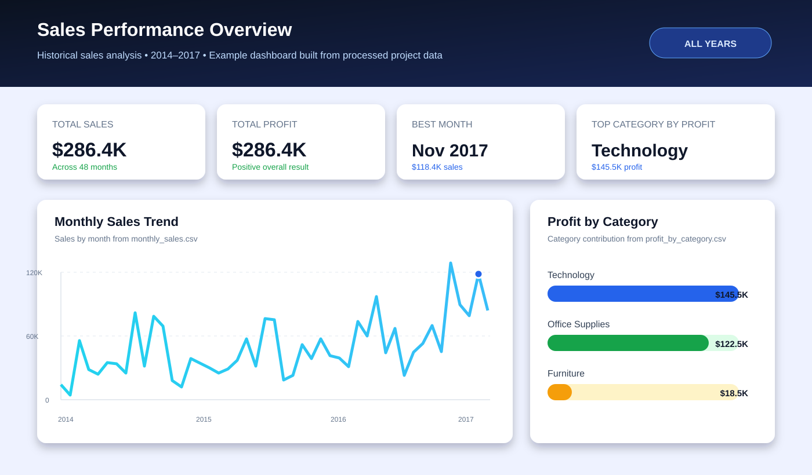
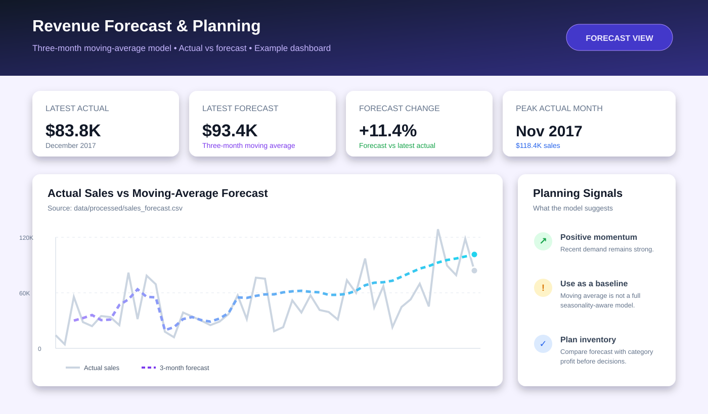

# 📊 Sales Forecasting & Business Intelligence Dashboard

A complete sales analytics project that processes historical sales data, uncovers business insights, and forecasts future revenue trends using Python, SQL, and Power BI.

## Overview

This project follows the full analytics lifecycle—from data cleaning and exploratory analysis to forecasting and dashboard reporting. It transforms raw transactional sales data into actionable business insights.

## Objectives

- Clean and preprocess raw sales data
- Perform exploratory data analysis (EDA)
- Identify revenue trends and seasonal sales patterns
- Detect low-performing or loss-making products and categories
- Build a time-series forecasting model for future sales
- Present insights through analysis outputs and a dashboard

## Tools & Technologies

- Python
- Pandas
- Matplotlib
- SQLite
- SQL
- Power BI
- Excel

> **Note:** Some processed data files may be large and may not preview directly on GitHub. For full access to the datasets, please contact the author through LinkedIn or email.

## What the Project Analyzes

### Exploratory Data Analysis

- Monthly revenue trends
- Category-wise sales performance
- Profit trends
- Loss-making products

### Business Intelligence Insights

- Top-performing categories
- Seasonal buying patterns
- Products generating financial losses
- Revenue growth trends over time

### Forecasting

- Monthly sales aggregation
- A moving-average forecast based on historical sales
- Trend data that can be used for planning and forecasting decisions

## Dashboard Examples

The following two example dashboards are generated from this project's processed CSV outputs. They are static SVG previews designed to show how the analysis can be presented in a Power BI-style business dashboard.

### 1. Sales Performance Overview

This view summarizes total sales, total profit, the best sales month, monthly sales movement, and profit contribution by category.



### 2. Revenue Forecast & Planning

This view compares actual monthly sales with the three-month moving-average forecast and highlights planning signals for inventory and revenue decisions.



To regenerate the example images after refreshing the processed data:

```bash
python scripts/05_create_dashboard_examples.py
```

> **Dashboard note:** The forecast is a simple three-month moving average, so these visuals are examples for portfolio presentation and planning—not a replacement for a production forecasting model.

## How to Run

Run these commands from the repository root:

```bash
git clone https://github.com/dhanushmaranii2604/Sales-Forecasting-Business-Intelligence-.git
cd Sales-Forecasting-Business-Intelligence-

python -m pip install pandas matplotlib

python scripts/02_data_cleaning.py
python scripts/01_load_and_check_data.py
python scripts/03_eda.py
python scripts/04_forecasting.py
python scripts/05_create_dashboard_examples.py
```

The scripts expect the raw input file at `data/raw/sales.csv` and create analysis outputs in `data/processed/`.

> **Windows users:** If `python` is not recognized, replace it with `py` in the commands above.

## SQL Analysis

The SQL queries are available in [`sql/sales_analysis.sql`](sql/sales_analysis.sql). They cover:

- Monthly sales totals
- Profit by category
- Loss-making products
- Overall sales and profit totals

## Generated Outputs

The scripts generate files such as:

- `data/processed/sales_cleaned.csv`
- `data/processed/monthly_sales.csv`
- `data/processed/profit_by_category.csv`
- `data/processed/loss_products.csv`
- `data/processed/sales_forecast.csv`
- `data/processed/monthly_sales_trend.png`
- `dashbords/dashboard_overview.svg`
- `dashbords/dashboard_forecast.svg`

## Skills Demonstrated

- Data cleaning and preprocessing
- Exploratory data analysis
- SQL query writing
- Time-series forecasting
- Business insight generation
- Data visualization
- End-to-end analytics workflow

## Project Structure

```text
Sales-Forecasting-Business-Intelligence-/
├── data/
│   ├── raw/
│   │   └── sales.csv
│   └── processed/                 # Generated by the scripts
├── dashbords/                     # Dashboard examples and database assets
│   ├── dashboard_overview.svg
│   ├── dashboard_forecast.svg
│   └── sales.db
├── scripts/
│   ├── 01_load_and_check_data.py
│   ├── 02_data_cleaning.py
│   ├── 03_eda.py
│   ├── 04_forecasting.py
│   └── 05_create_dashboard_examples.py
├── sql/
│   └── sales_analysis.sql
└── README.md
```

## Author

**Dhanush M** — MCA Graduate, IT Support Executive

- 📧 [dhanushmaranii@gmail.com](mailto:dhanushmaranii@gmail.com)
- 💼 [LinkedIn](https://www.linkedin.com/in/dhanush-thetechie/)

---

This project demonstrates a practical, end-to-end analytics workflow—from cleaning raw sales data to generating forecasts and analysis outputs that support better business decisions.
